# Neglelaboratoriet

## About
Neglelaboratoriet is a commercial website created for people who are interested in doing their nails regularly and looking for a good nail artist. The salon offers different types of manicures depending on the customers' preferences.

The website's visitors will be able to find all the details they require about the services the company provides, see pictures with the work done for previous customers and get in touch with it in order to book an appointment. Furthermore, the customers can find details about the location and how to find it. 

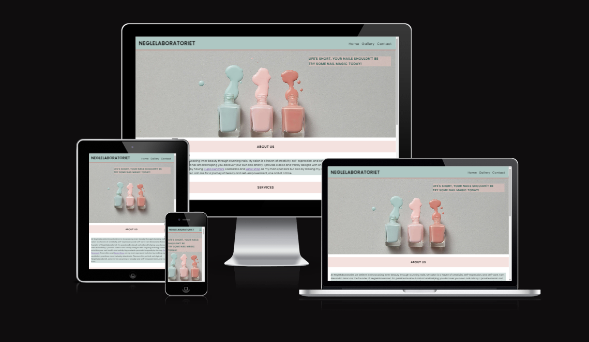

## User experience (UX)

This website is designed to cater to individuals who identify as women and enjoy getting their nails done professionally at a salon.

On the contact page, there is clear navigation and a form to book appointments.

+ First-time visitor goals

    + Learn about the site's purpose and services offered.

    + The website is designed to be easy to navigate.

    + Navigating the website is designed to be effortless and user-friendly.

+ Returning and frequent visitor goals
    + To be up to date with the salon's services.
    + To locate the contact page and the physical address.
    + To browse the latest nail art collection in the gallery.

## Features

+ This website is targeting individuals that want to have their nails done in a professional salon.
+ They can do that by navigating to the contact page and fill in a form for booking an appointment.
+ It is responsive on all kind of devices.

## Existing Features

+ Navigation Bar
  
  + It is shown and has a fixed position on all of the pages including the form-received page.
  + The business's name, Neglelaboratoriet, can be found on the left side of the navigation, which is placed on the top of the page. When clicked, this would lead back to the top.
  + The additional navigation links are aligned to the right hand side and arranged in a row. These are called: Home, Gallery and Contact.
  + Because the screen is substantially smaller on a mobile device, the navigation links have a drop off toggle to allow for more room.
  + The navigation is capitalized to make it easier to see and is black in colour to contrast with the background colour.
  + All of the aforementioned information makes it easier for the user to find what they're looking for.

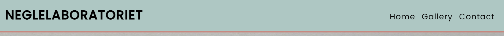

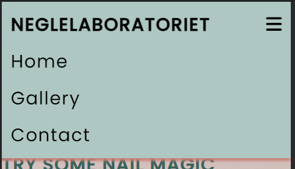

+ Main Heading
    + It consists of a background picture that features three nail polish bottles that are spilled.
    + Main heading is composed of the business's name and the the three navigation links namely: Home, Gallery and Contact:
        + The home page is composed of the motto 'LIFE'S SHORT, YOUR NAILS SHOULDN'T BE TRY SOME NAIL MAGIC TODAY!
        + The gallery consists of multiple photos of the previous services done for their customers.
        + The contact page is composed of 'Let us book you on appointment' and how to find us.
        + The thank you page consists of 'Thank you for contacting us! We will come back to you shortly'.
       
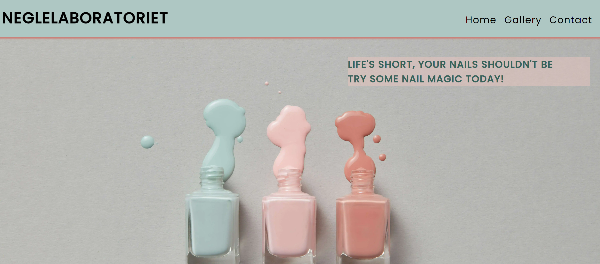
  
+ [Home Page](https://monicaular.github.io/Alexandra-Dancuta-Cupio/index.html)

    + The home page is evidentiated by an image which reflects what the business's activity is. This is overlayed by a motto which urges the user to take action.

  + Three sections, namely About, Services, and Book Now, make up the home page. The bright background of the headings contrasts with the dark colour used in the lettering. The user can go to these parts by sliding or scrolling down the page.
    + About Section
      + Its purpose is to provide the user with some background information on the artist and the person who is providing them with the service.
  
      + It cites well-known companies that are supporting the company to evoke a sense of credibility in the user.
  
    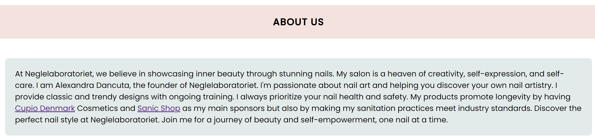

    + Services Section
      + Its purpose is to include all of the services that the company provides, along with a brief explanation of each one for the first-time visitors.
      + It illustrates examples of each of the service that the business is offering in order to get a visual idea for first-time users of what to expect.
  
    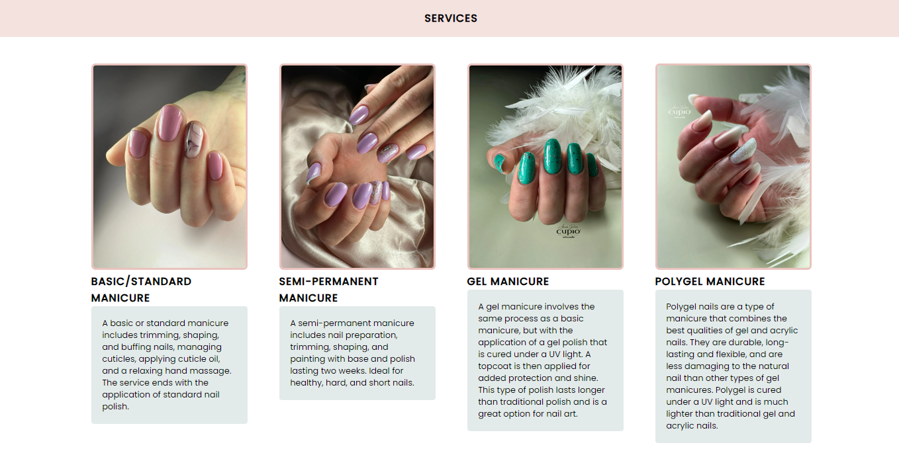
  
    + Book Now Section
      + It comprises of a Book Now button which takes the user to the contact page to fill in the form.
      + It changes colour when user hovers on it in order for them to know where they are. 
 
    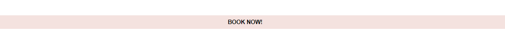
    

+ [Gallery Page](https://monicaular.github.io/Alexandra-Dancuta-Cupio/gallery.html)
    
    + This page will provide the user with supporting ilustrastions so they can view more about the various services.
    + It is important to the user as they will see previous services offered.

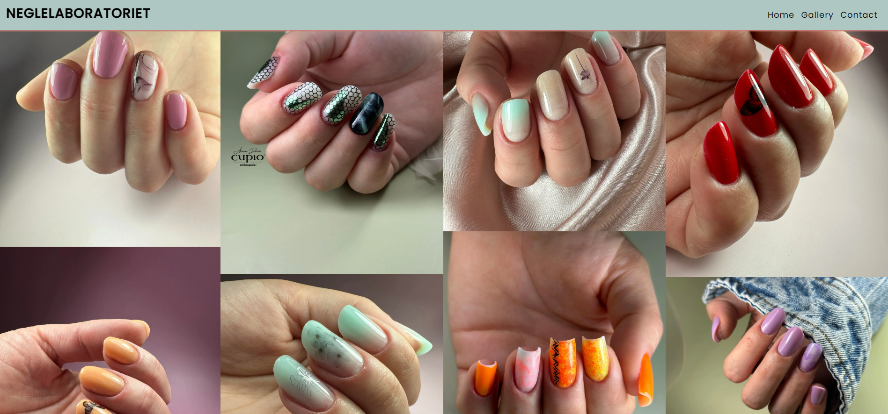

+ [Contact Page](https://monicaular.github.io/Alexandra-Dancuta-Cupio/contact.html)
    
    + Form Section
        + This page will allow the user to fill in their details and choose a service they would be interested in, as well as leave a contact number.
        + This page can also be used as a feedback page as the user can leave a message for the business.
  
    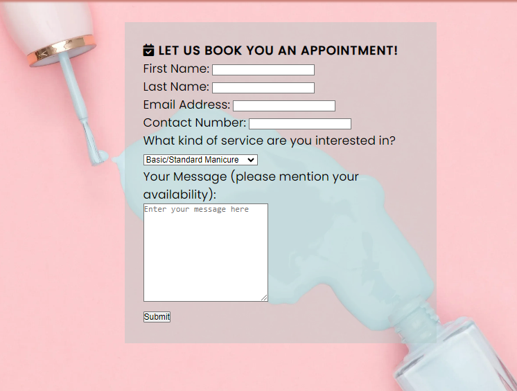

    + The Thank You form-received section
        + This helps the user know that their form has been submitted.

    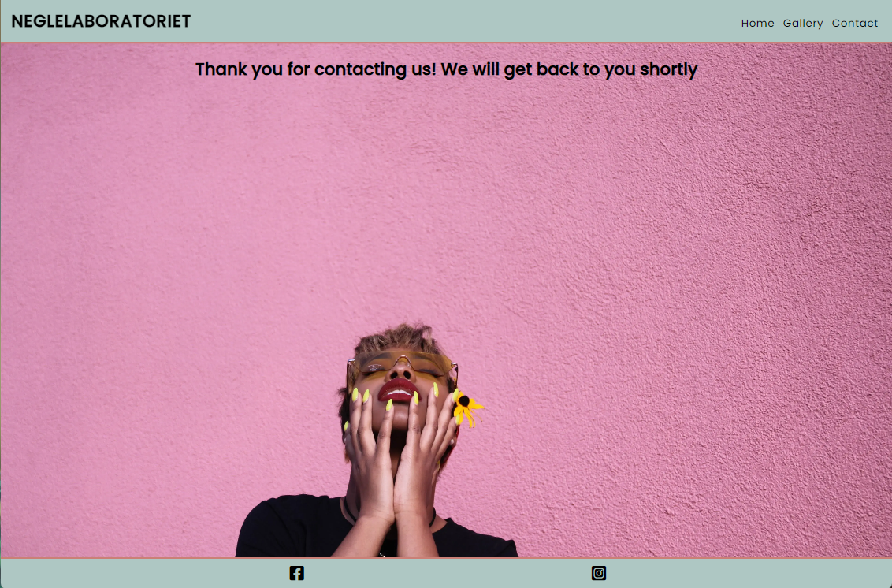
    
    + How to find us section
        + This section is comprised of a link with the address which takes the user to a maps website with the location.
        + It is important for the user as they can use the new window page to navigate to the salon's location.
        + It has an image with the dropped pin for the users that are local and don't need the navigator.
    
    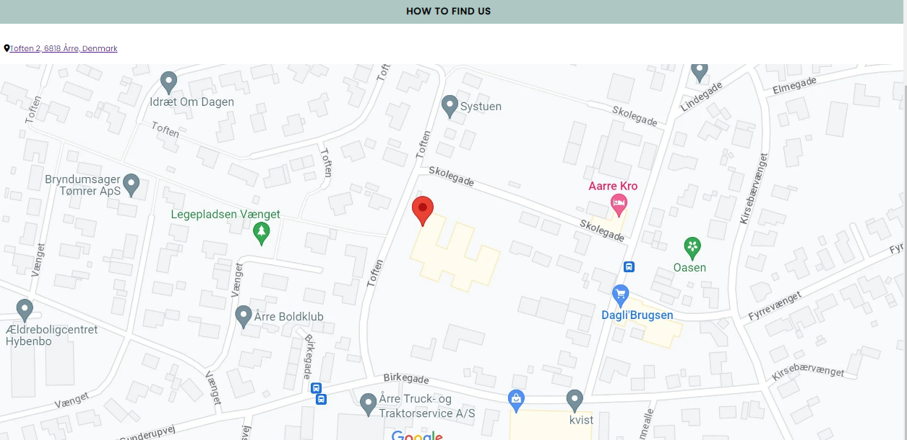

+ Footer
  + Links to the facebook and instagram page of the business.
  + It is important for the users as they can see extra info and also offers an easier way to contact the business.
  + It is featured on all the pages.

## Features to be implemented

+ Additional images to the gallery.
+ Additional services for the business.
+ A live booking calendar.

## Design

+ Colour Scheme

    + Main colours used for the website:

    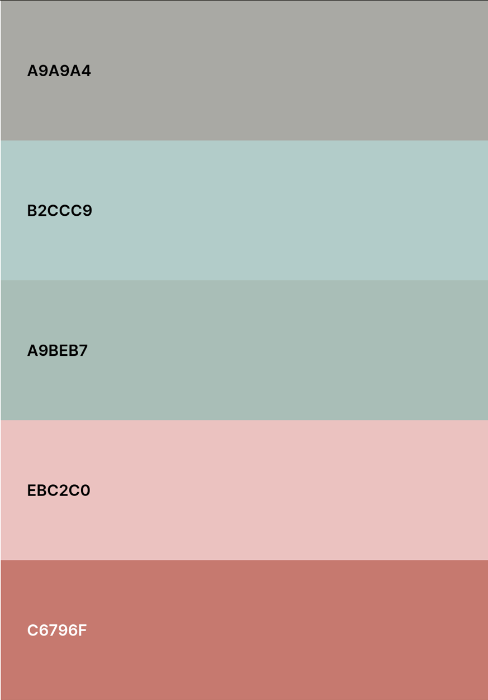

+ Typography
    + The font used is "Poppins" sans serif to make sure it will work for all kind of browsers.

+ Wireframes

  + [Balsamiq](<https://balsamiq.com/wireframes/>)
  
  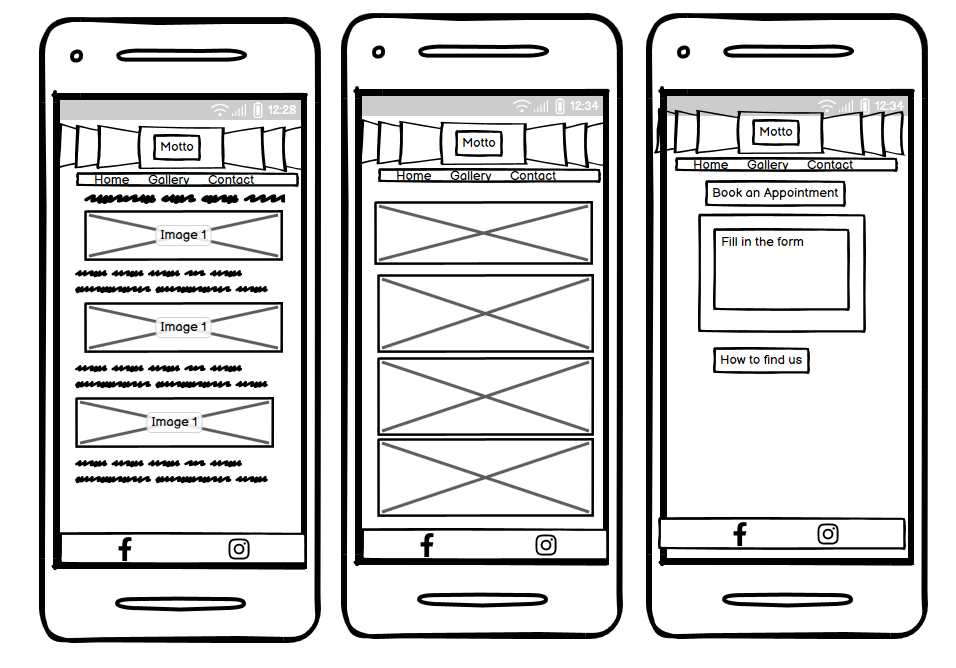

## Technologies Used

+ HTML5
+ CSS3

## Frameworks, Libraries and Programs Used

+ Gitpod
    + To write the code.
+ Git
  + For vesion control.
+ Github
  + Deployment of the website and storing the files online.
+ Google Fonts
    + Import main font the website.
+ Am I Responsive
    + Mockup picture for the README file.
   
## Testing

Every page of the project was checked for errors using the W3C Markup Validator and W3C CSS Validator services.

+ [W3C Mark-Up Validator](<https://validator.w3.org/>)
+ [W3C CSS Validator](https://validator.w3.org/)

### Validation Results

<b>index.html</b>

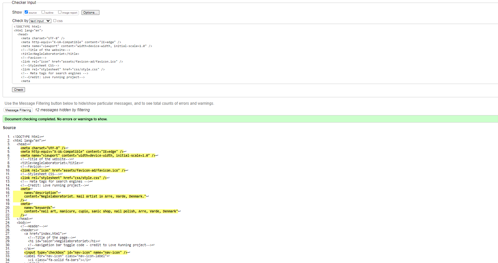

<b>gallery.html</b>

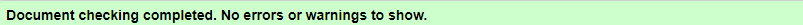

<b>contact.html</b>

<b>thank-you.html</b>

<b>style.css</b>

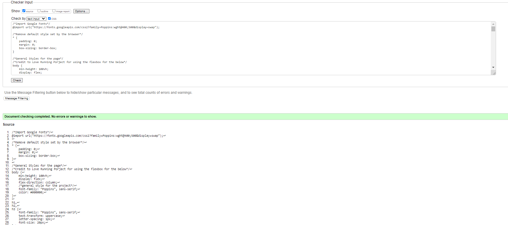

### Manual Testing
+ The website was tested on Google Chrome, Microsoft Edge, and Firefox browsers.
+ The website was viewed on a desktop computer, laptop, and an iPhone 13 mobile phone.
+ A large amount of testing was done to ensure links between pages are working correctly on all pages.
+ Friends and relatives were asked to review the website for a better understanding of the user experience.
+ Dev Tools was used to test how the site looks on various screen sizes.

### Lighthouse Report

**Mobile Analisys**

Home Page

Gallery

Contact

Thank-you

  

    

